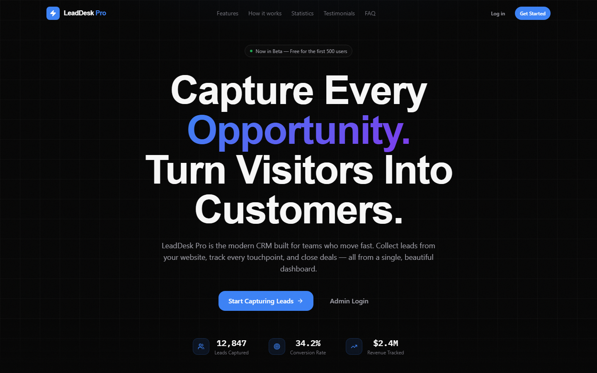
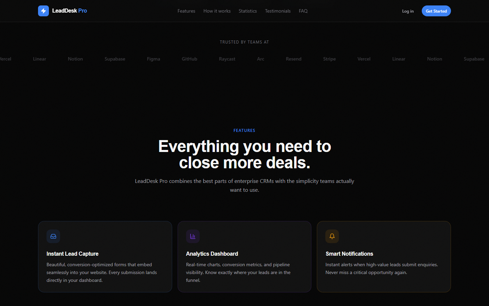
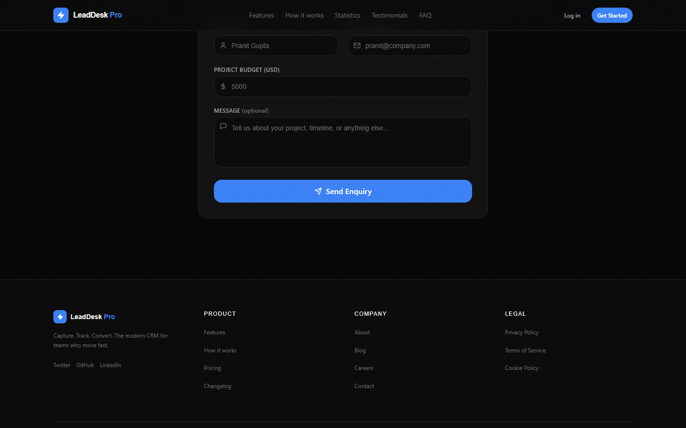
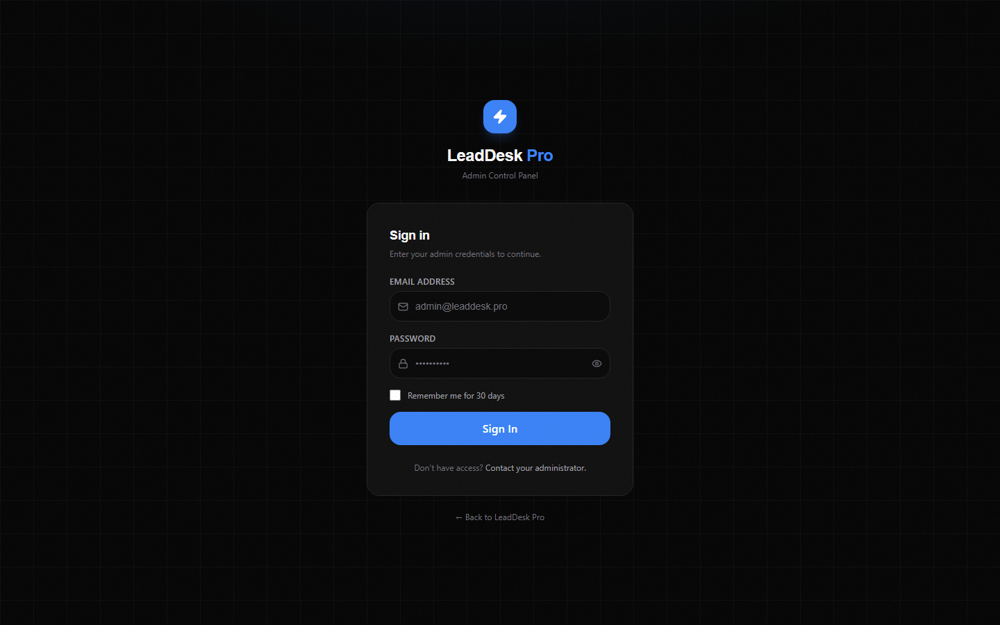
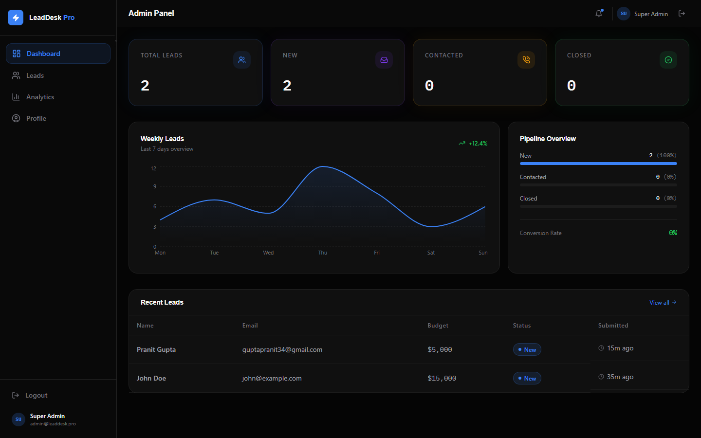
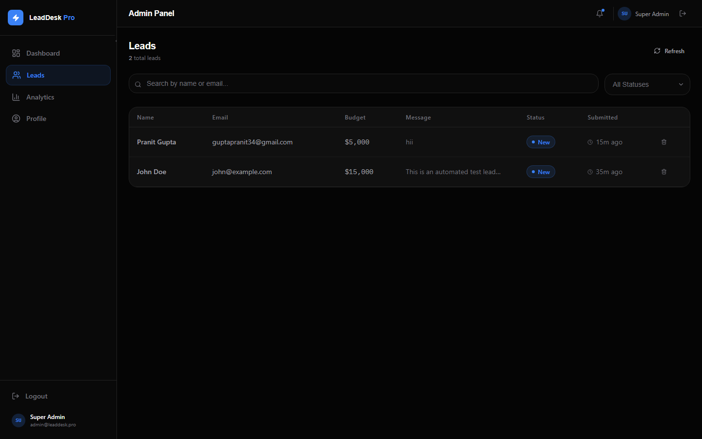
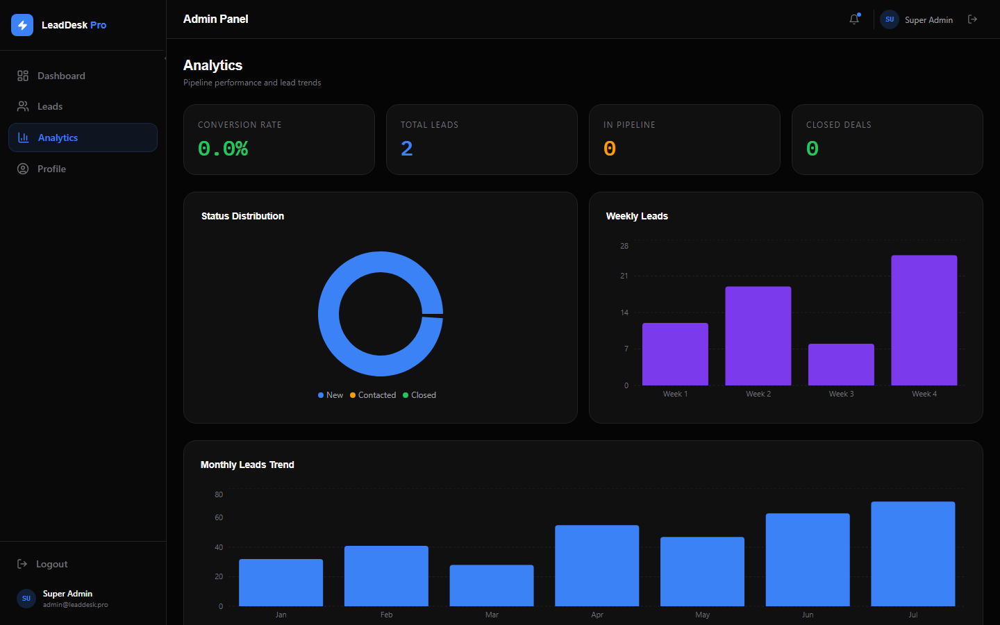
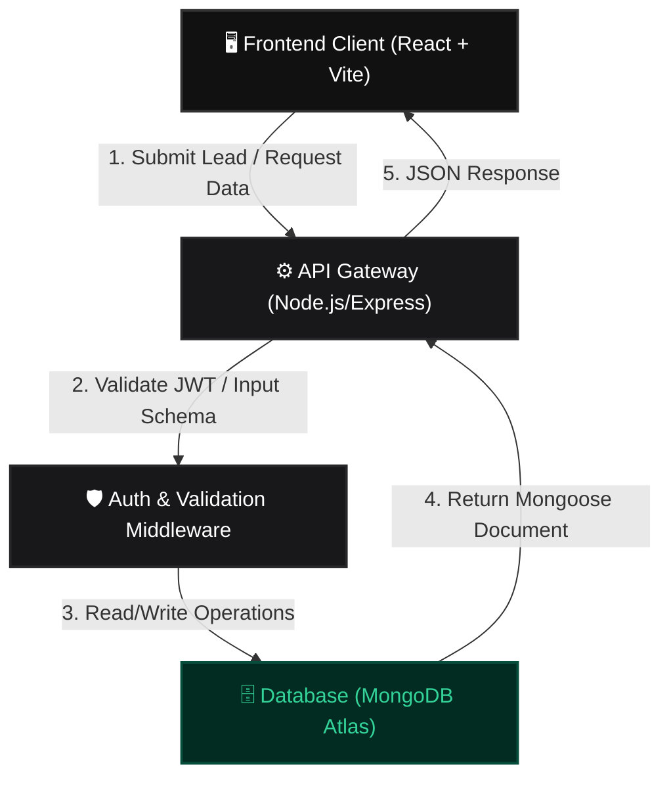

# 🎯 LeadDesk Pro — Premium SaaS CRM & Lead Management Platform

[](https://react.dev/)
[](https://vite.dev/)
[](https://nodejs.org/)
[](https://expressjs.com/)
[](https://www.mongodb.com/)
[](https://tailwindcss.com/)
[](https://www.framer.com/motion/)
[](https://jwt.io/)

---

## 📖 1. Project Overview

**LeadDesk Pro** is a modern, enterprise-grade SaaS CRM designed for high-velocity teams to capture, track, and convert business inquiries effortlessly. Built with a **React + Vite** frontend and a robust **Node.js/Express/MongoDB** backend API, the application provides a seamless pipeline from public form submission to administrative analytics.

Designed with a high-fidelity "dark-luxury" aesthetic inspired by modern developer tools like Linear, Vercel, and Raycast, the platform features Neo-Brutalism elements, deep black surfaces (`#050505`), glassmorphism, and meticulously crafted typography.

Operators and teams can:
- **Capture Leads** through a stunning, highly-responsive public landing page.
- **Track Pipelines** in a secure, JWT-protected admin dashboard.
- **Analyze Conversion Rates** with interactive Recharts visualizations (Pie charts, Bar metrics).
- **Manage Statuses** (New, Contacted, Closed) using a buttery-smooth data table with slide-out drawers.
- **Enjoy Premium UI** powered by Framer Motion micro-interactions, custom design tokens, and a strict 8pt grid system.

---

## 🎨 2. App Screenshots

### 🏠 Landing Page — Hero


### ✨ Landing Page — Features


### 📬 Landing Page — Lead Capture Form


### 🔐 Admin Login


### 📊 Admin Dashboard


### 👥 Leads Management Table


### 📈 Analytics & Charts


---

## ✨ 3. Core Features

- 🔐 **Secure Authentication**: JWT-based stateless authentication featuring encrypted password hashing via `bcryptjs`, HttpOnly strategies, and protected route wrappers.
- 🚀 **High-Performance API**: Professional MVC architecture using Express, `express-validator` for strict schema validation, `helmet` for security headers, and `morgan` for logging.
- 📈 **Interactive Analytics Dashboard**: Beautiful telemetry summary displaying pipeline health, conversion rates, and status distributions using `recharts`.
- 🗃️ **Advanced Lead Management**: Server-side pagination, search indexing, status filtering, and soft-delete mechanisms to maintain historical integrity.
- 💎 **Premium SaaS UI (Dark Mode First)**: Responsive, custom-tailored design system avoiding generic templates. Features a custom CSS noise overlay, curated color palettes, Clash Display/General Sans typography, and fluid `framer-motion` animations.
- 🛡️ **Robust Form Validation**: Client-side validation using `React Hook Form` combined with `Zod` resolvers for bulletproof data entry and error handling.

---

## 🏗️ 4. System Architecture



---

## 🛠️ 5. Technical Stack

### Frontend
| Technology | Description |
| :--- | :--- |
| **React (v19)** | Declarative component architecture |
| **Vite** | Modern, ultra-fast frontend build toolchain |
| **Tailwind CSS** | Utility-first styling tied to custom design tokens |
| **Framer Motion** | Cinematic micro-interactions and transitions |
| **Lucide React** | Modern, clean iconography |
| **Recharts** | High-performance dashboard visualizations |
| **React Hook Form + Zod** | Type-safe form validation |

### Backend
| Technology | Description |
| :--- | :--- |
| **Node.js** | Server-side JavaScript runtime |
| **Express.js** | Fast, minimalist web framework for APIs |
| **Mongoose** | Elegant MongoDB object modeling for Node.js |
| **JWT & bcryptjs** | Secure token-based authorization and encryption |
| **Express Validator** | Middleware for robust request validation |

### Database & Deployment
| Layer | Solution |
| :--- | :--- |
| **Database** | MongoDB Atlas (Cloud Database Cluster) |
| **Frontend Hosting** | Vercel (Recommended) |
| **Backend API Hosting** | Render / Heroku |

---

## 📂 6. Repository Folder Structure

```text
LeadDesk-Pro/
├── assets/
│   └── screenshots/         # UI screenshots for documentation
├── frontend/                # React Client Application
│   ├── src/
│   │   ├── components/      # Reusable UI (Buttons, Cards, Navbar, Sidebar)
│   │   ├── contexts/        # AuthContext global state
│   │   ├── lib/             # Axios API instance and utility functions
│   │   ├── pages/           # Pages (Landing, Login, Dashboard, Leads)
│   │   ├── App.jsx          # Router & Layout Configuration
│   │   └── index.css        # Design tokens, noise textures, global styles
│   └── package.json
├── backend/                 # Node.js API Gateway
│   ├── src/
│   │   ├── config/          # MongoDB connection logic
│   │   ├── controllers/     # Lead & Auth business logic
│   │   ├── middleware/      # JWT protection & Error boundaries
│   │   ├── models/          # User & Lead Mongoose schemas
│   │   ├── routes/          # Express API route definitions
│   │   └── server.js        # Entry point for backend
│   └── package.json
└── START_GUIDE.md           # Developer quickstart instructions
```

---

## 💻 7. Local Setup Guide

Follow these steps to run LeadDesk Pro on your local computer.

### Step 1: Clone the Repository
```bash
git clone https://github.com/gpranit16/lead-desk.git
cd lead-desk
```

### Step 2: Configure the Backend API
```bash
cd backend

# Install dependencies
npm install

# Setup Environment Variables (Create a .env file based on .env.example)
# MONGODB_URI=your_atlas_connection_string
# JWT_SECRET=your_secret_key
# PORT=5000

# Seed the database with the default Admin user
npm run seed

# Run backend in development mode
npm run dev
```

### Step 3: Configure the React Client
```bash
# Open a new terminal tab/window
cd frontend

# Install dependencies
npm install

# Start development client
npm run dev
```
Open your browser and navigate to `http://localhost:5173`.

---

## 🔐 8. API Reference

### Authentication Services
| Method | Endpoint | Description | Access |
| :--- | :--- | :--- | :--- |
| `POST` | `/api/auth/login` | Authenticate admin and return JWT token | Public |
| `GET` | `/api/auth/me` | Get current logged-in user details | Private |

### Lead Management
| Method | Endpoint | Description | Access |
| :--- | :--- | :--- | :--- |
| `POST` | `/api/leads` | Submit a new lead inquiry from the landing page | Public |
| `GET` | `/api/leads` | Retrieve paginated leads with search/filter | Private |
| `PATCH` | `/api/leads/:id/status`| Update the pipeline status of a specific lead | Private |
| `DELETE` | `/api/leads/:id` | Soft-delete a lead (hides from view) | Private |
| `GET` | `/api/leads/stats` | Get aggregated pipeline metrics for dashboard | Private |

---

## 📝 9. Professional Summary (Resume Check)

- **Problem**: Startups often rely on fragmented spreadsheets and generic, poorly designed CRM templates that fail to impress users or securely manage inbound pipelines.
- **Solution**: Engineered a bespoke, high-performance SaaS CRM featuring a public-facing capture engine and a highly secure administrative panel, styled with a proprietary dark-mode design system.
- **Key Achievements**:
  - Implemented secure RESTful endpoints utilizing JWT authorization and rigorous `express-validator` sanitation, reducing invalid data ingestions.
  - Architected a responsive, framer-motion-enhanced React frontend that strictly adheres to modern Neo-Brutalist and Linear-inspired UX/UI paradigms.
  - Optimized dashboard analytical queries using MongoDB aggregation pipelines, rendering complex pipeline health visualizations instantaneously.

---

## 📄 10. License

Distributed under the MIT License. See [LICENSE](LICENSE) for details.

---
*Built for the Digital Heroes Training Task.*
